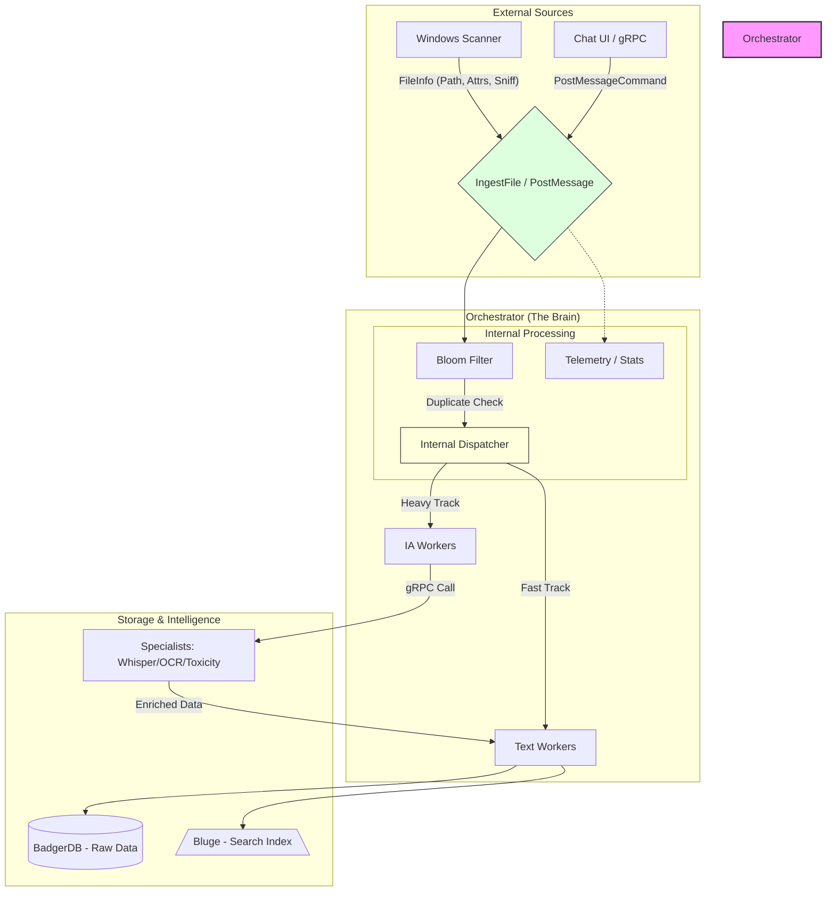

```mermaid
graph TD
    subgraph "External Sources"
        Scanner[Windows Scanner] -- "FileInfo (Path, Attrs, Sniff)" --> Ingest
        Chat[Chat UI / gRPC] -- "PostMessageCommand" --> Ingest
    end

    subgraph "Orchestrator (The Brain)"
        direction TB
        Ingest{IngestFile / PostMessage}
        
        subgraph "Internal Processing"
            Bloom[Bloom Filter] -- "Duplicate Check" --> Dispatcher
            Stats[Telemetry / Stats]
            Dispatcher[Internal Dispatcher]
        end
        
        Ingest --> Bloom
        Ingest -.-> Stats
        
        Dispatcher -- "Fast Track" --> WorkersText[Text Workers]
        Dispatcher -- "Heavy Track" --> WorkersIA[IA Workers]
    end

    subgraph "Storage & Intelligence"
        WorkersText --> Badger[(BadgerDB - Raw Data)]
        WorkersText --> Bluge[/Bluge - Search Index\]
        
        WorkersIA -- "gRPC Call" --> Specialists[Specialists: Whisper/OCR/Toxicity]
        Specialists -- "Enriched Data" --> WorkersText
    end

    style Orchestrator fill:#f9f,stroke:#333,stroke-width:2px
    style Ingest fill:#dfd,stroke:#333
    style Dispatcher fill:#ffd,stroke:#333
```