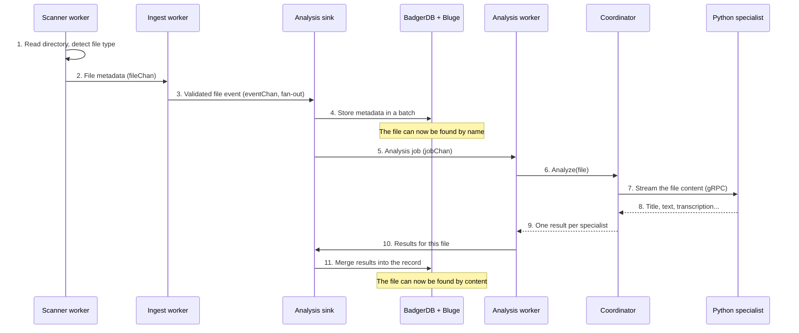

# Sequence

What happens to one file, from the scan to the moment it can be found by its content.

```mermaid
sequenceDiagram
    participant S as Scanner worker
    participant I as Ingest worker
    participant K as Analysis sink
    participant DB as BadgerDB + Bluge
    participant A as Analysis worker
    participant C as Coordinator
    participant P as Python specialist

    S->>S: 1. Read directory, detect file type
    S->>I: 2. File metadata (fileChan)
    I->>K: 3. Validated file event (eventChan, fan-out)
    K->>DB: 4. Store metadata in a batch
    Note over DB: The file can now be found by name
    K->>A: 5. Analysis job (jobChan)
    A->>C: 6. Analyze(file)
    C->>P: 7. Stream the file content (gRPC)
    P-->>C: 8. Title, text, transcription...
    C-->>A: 9. One result per specialist
    A->>K: 10. Results for this file
    K->>DB: 11. Merge results into the record
    Note over DB: The file can now be found by content
```
